# PG Buddy
*Your ultimate companion for managing PG life!*

 
 

 


**PGBuddy** is a React (frontend) & Spring Boot (backend) based application designed to streamline the management of Paying Guest (PG) accommodations for residents (PG Mates). It provides an user-friendly interface for residents to handle payments, submit complaints, manage meal preferences, and more, while offering admins tools to oversee operations.

Staying in a PG in a city like Bengaluru can be a real hassle—think about the delayed fixes, payment mix-ups, and zero communication. This web app is a try to sort all that out, making life in your PG way smoother!

<p align="center">
  
</p>

---

## ☁️ Hosting

This project is hosted on **Vercel** cloud and can be accessed at:  
🔗 [PG Buddy Website](https://pg-buddy-front-end.vercel.app)

**Test Credentials:**  
- Resident user:
  - **Username:** `guestuser@gmail.com`  
  - **Password:** `guestuser`  
- Admin user:
  - **Username:** `admin@gmail.com`  
  - **Password:** `admin123` 

Or, you can create your own profile as a resident user using the **Registration** page.

---

## ✨ Features

- **Dark Theme**: A sleek dark theme for better readability and aesthetics.
- **Modular Components**: Well-structured React components for easy maintenance and scalability.
- **Design**: Currently the UI is only designed and optimised for desktop screen with future plans for tablets and mobile devices.

### 👤 Resident View (PG Mates)
- **Secure Authentication**: Sign up or log in via email/phone with JWT-based authentication (Spring Security).
- **Rent & Payments**: View rent dues, pay securely via Razorpay, and track your payment history.
- **Support Tickets**: Raise issues (e.g., "AC not working"), track status (Pending, In Progress, Resolved), and chat with the admin.
- **Notice Board**: View and bookmark announcements (e.g., "Water maintenance tomorrow").
- **Meal Preferences**: Choose daily/weekly meal type (Veg/Non-Veg) and view real-time user vote counts.
- **Café Ordering**: Browse the café menu, place orders, and reorder from order history.
- **Utilities**: Monitor internet/electricity usage and purchase internet add-on packs.
- **Profile Management**: Update your profile and view admin contact details.

### 🛠️ Admin View (PG Managers)
- **Ticket Dashboard**: View, assign, update ticket statuses, and chat with residents.
- **Notice Management**: Post and manage important notices for all residents.

---

## ⚙️ Technologies Used

- **Frontend**: React, Vite, Axios, React Router
- **Backend**: Spring Boot, Spring Security, Spring WebSockets (SockJS + STOMP)
- **Database**: MySQL
- 🔌 **Other Notable Integrations**:
  - Implemented **real-time chat** using $\color{teal}{\textsf{WebSockets}}$ over **SockJS** with a simple **message broker**; clients send messages to `"/app/chat.sendMessage"` and receive them via `"/user/queue/messages"`.
  - Integrated $\color{teal}{\textsf{Razorpay}}$ for rent and café **payment handling** with both **API and checkout UI**.
  - Used $\color{teal}{\textsf{React Router}}$ for client-side **routing** and enforced **access control** between residents and admins.
  - Enabled $\color{teal}{\textsf{JWT-based authentication}}$ using **Spring Security** for secure login.
  - Applied $\color{teal}{\textsf{BCrypt hashing}}$ for password encryption; **no plain-text passwords** stored in the **MySQL database**.
  - All application data is persisted in a $\color{teal}{\textsf{MySQL}}$ backend.

---

## 🛠️ Project Structure
Here’s an overview of the project’s file structure:
```
pg-buddy/
├── public/                 # Static assets (e.g., images, favicon)
├── src/                    # Source code
│   ├── App.css             # Global styles for the app
│   ├── App.jsx             # Main App component
│   ├── axiosConfig.js      # Axios configuration for API calls
│   ├── index.css           # Global CSS styles
│   ├── main.jsx            # Entry point for the React app
│   ├── assets/             # Static assets for the app
│   │   └── react.svg
│   ├── components/         # Reusable React components
│   │   ├── Account/        # Account-related components
│   │   │   ├── Account.css
│   │   │   ├── Account.jsx
│   │   │   ├── Feedback/
│   │   │   │   ├── Feedback.css
│   │   │   │   ├── Feedback.jsx
│   │   │   ├── KC/         # Knowledge Centre
│   │   │   │   ├── KnowledgeCentre.css
│   │   │   │   ├── KnowledgeCentre.jsx
│   │   │   ├── Profile/
│   │   │       ├── ProfilePage.css
│   │   │       ├── ProfilePage.jsx
│   │   ├── AdminPages/     # Admin-related components
│   │   │   ├── AdminAccount/
│   │   │   │   ├── AdminAccount.css
│   │   │   │   ├── AdminAccount.jsx
│   │   │   ├── AdminNavigation/
│   │   │   ├── AdminNoticePage/
│   │   │   ├── PageProtection/
│   │   ├── Authentication/ # Authentication components
│   │   │   ├── Common.css
│   │   │   ├── Login.jsx
│   │   │   ├── Register.jsx
│   │   ├── Cafe/           # Cafe-related components
│   │   │   ├── Cafe.css
│   │   │   ├── Cafe.jsx
│   │   │   ├── CafeGrid/
│   │   │   ├── OrderHistory/
│   │   │   ├── OrderSummary/
│   │   ├── Food/           # Food-related components
│   │   │   ├── Food.css
│   │   │   ├── Food.jsx
│   │   │   ├── MenuCard/
│   │   ├── Home/           # Home page components
│   │   │   ├── Home.css
│   │   │   ├── Home.jsx
│   │   │   ├── AllTicketsListPage/
│   │   │   ├── CreateTicketsPage/
│   │   │   ├── IndividualTicketsViewPage/
│   │   │   ├── MainPage/
│   │   ├── Navigation/     # Navigation components
│   │   │   ├── TopNavigationBar.css
│   │   │   ├── TopNavigationBar.jsx
│   │   ├── Services/       # Services-related components
│   │   │   ├── Services.css
│   │   │   ├── Services.jsx
│   │   │   ├── ElectricityUsage/
│   │   │   ├── InternetPlans/
│   │   │   ├── RoomCleaningService/
│   │   ├── Stay/           # Stay-related components
│   │       ├── Stay.css
│   │       ├── Stay.jsx
│   │       ├── BookingDetailsBox/
│   │       ├── PaymentHistory/
│   │       ├── SummaryBox/
│   ├── websocketService.js
├── .env                    # Environment variables
├── .gitignore              # Git ignore file
├── eslint.config.js        # ESLint configuration
├── index.html              # HTML entry point
├── package.json            # Project dependencies and scripts
├── README.md               # Project documentation
├── vite.config.js          # Vite configuration
```

---
## 📄 Page Structure

### 🔐 Authentication
- `/login`
- `/register`

### 👥 Resident Pages
- `/home`
- `/food`
- `/stay`
- `/cafe`
- `/services`
- `/account`
- `/create-ticket-full-page`
- `/order-history`

### 🛡️ Admin Pages
- `/admin-notice-page`
- `/admin-account`

### 📚 Common Pages
- `/profile`
- `/knowledge-centre`
- `/feedback`
- `/ticket-list-full-page`
- `/ticket/:id`

---

## 📸 Screenshots

### Home Page
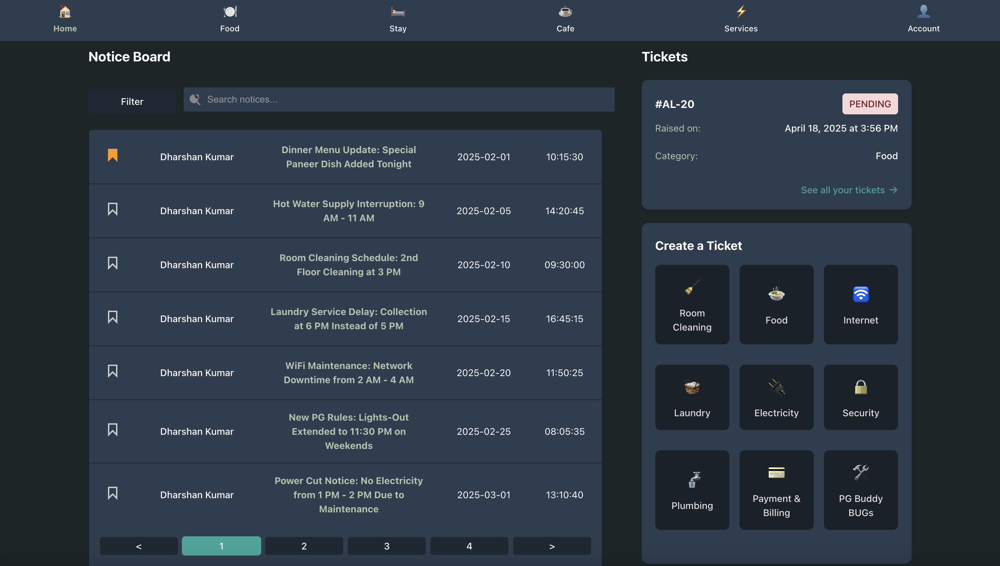
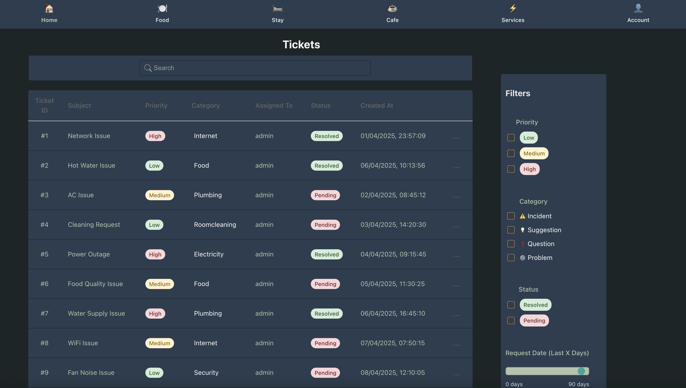
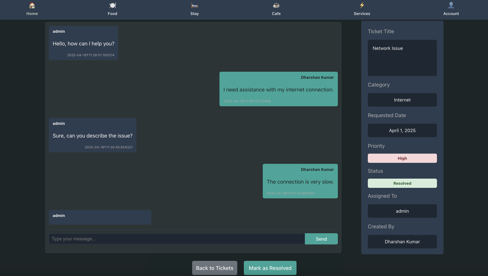
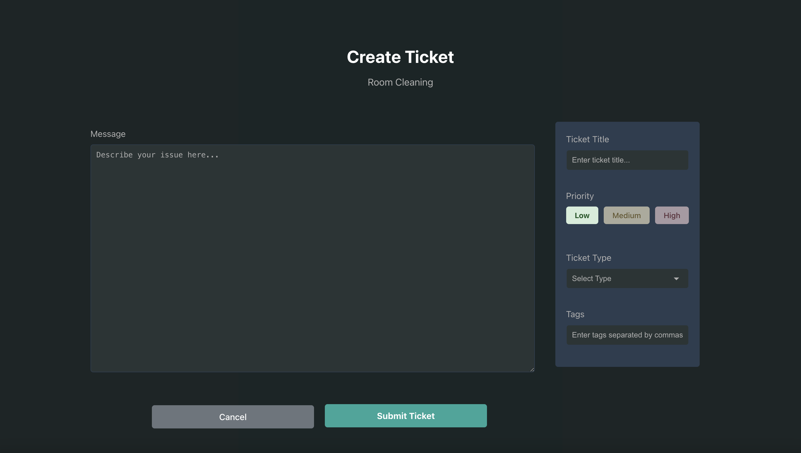

### Food Page
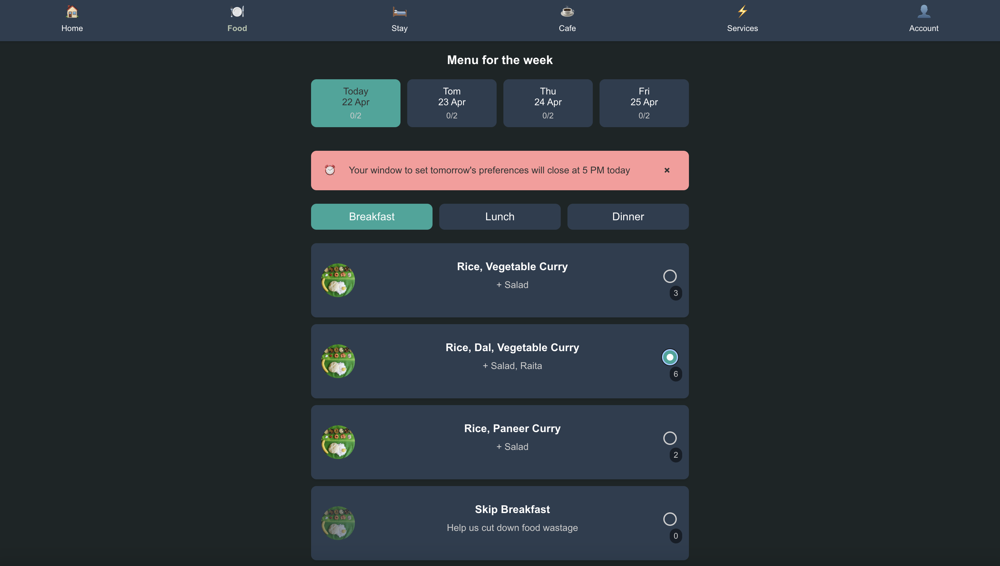

### Stay Page
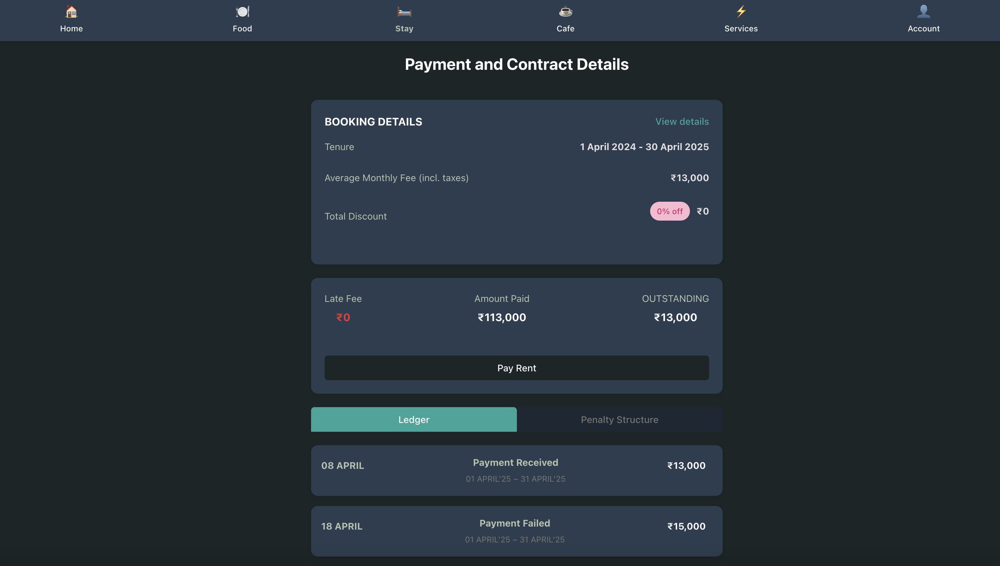
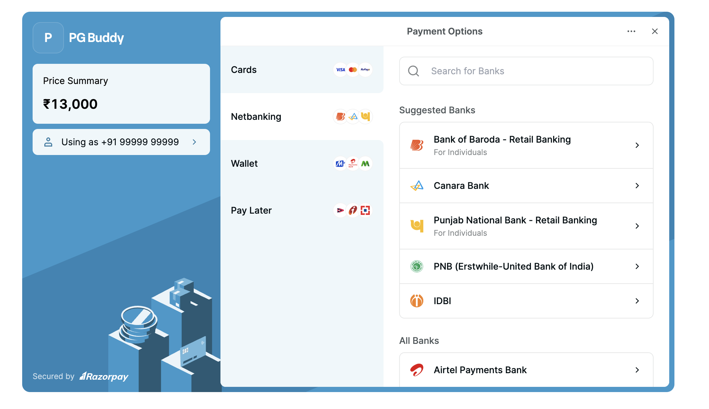
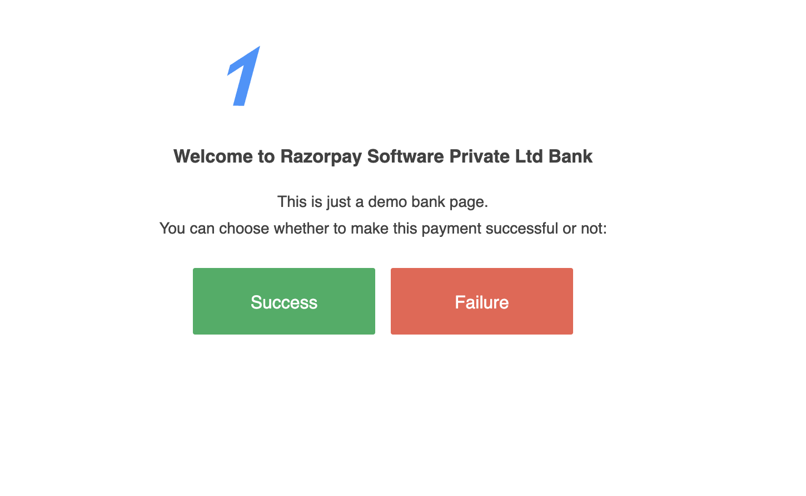

### Cafe Page
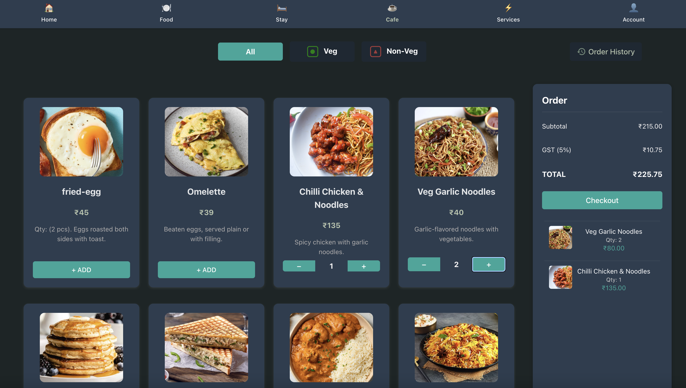
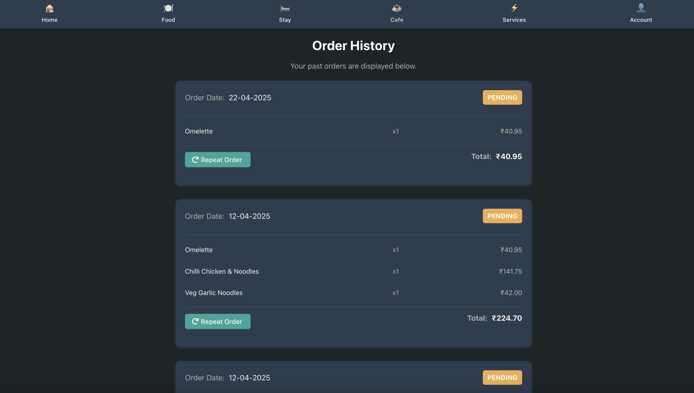

### Services Page
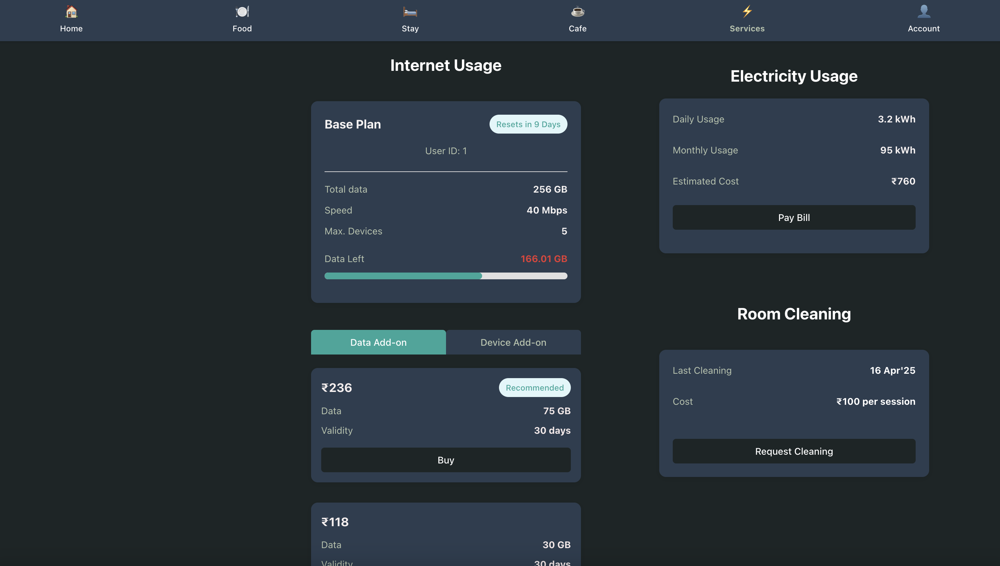

### Accounts Page
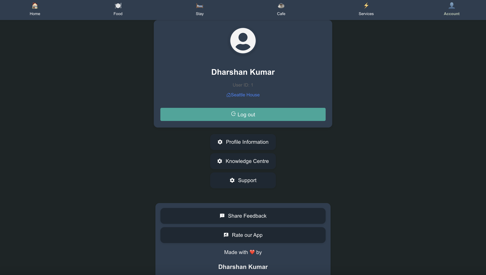

### Admin Page
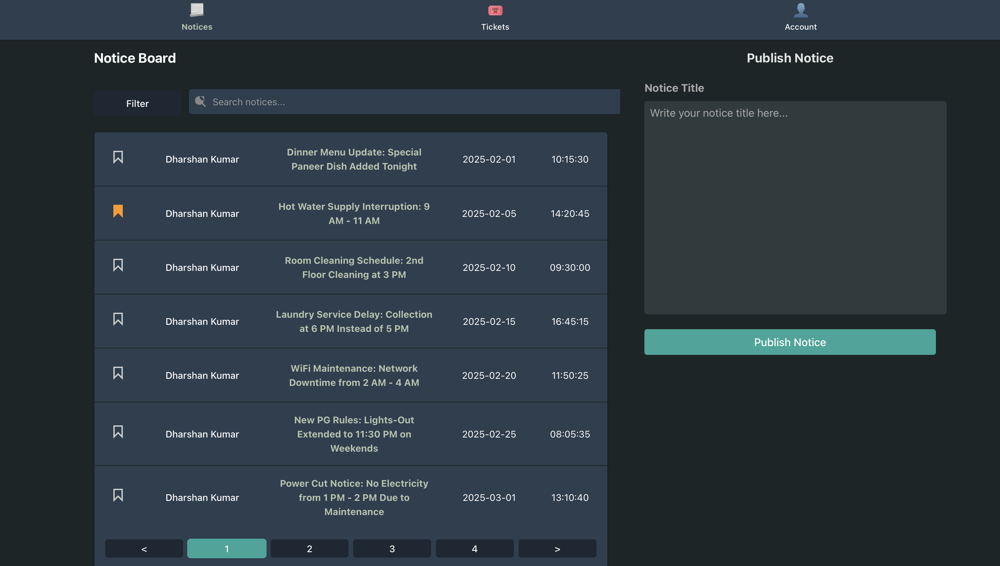

### Login Page
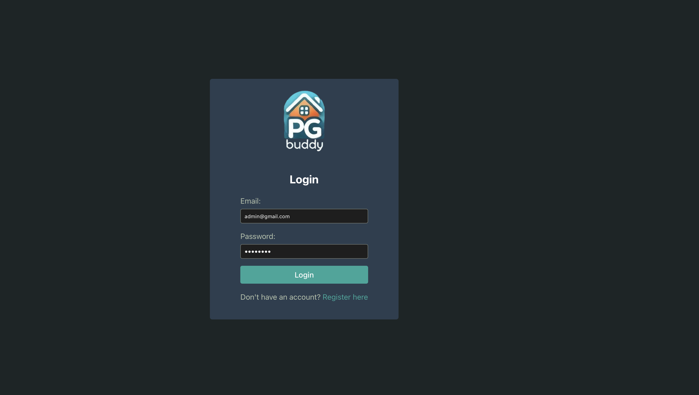

---
## 🎨 Color Scheme

This project follows a structured color scheme for a consistent and visually appealing UI. Below are the defined colors used across various components:

 🌍 Navigation Bar
- **Primary Navigation Bar Color:** 
- **Light Green Accent:** 

 🔘 Buttons
- **Selected Button (Green):** 
- **Unselected Button (Darker Green):** 
- **Hover Effect (Lite White):**  _(Text turns **black** when hovered)_

 🎨 Background Colors
- **Little Darker Background:** 
- **Much Darker Background:** 
- **Original Background Color:** 

 🔤 Text Colors
- **Full White:** 
- **Grey:** 
- **Greenish Grey (Recommended):** 
- **Darker Greenish Grey:** 

 💬 Message Boxes
- **Slightly Lighter Background for Message Box:** 

---
## ⚙️ Setup Instructions

### 🛠 Installation

Make sure you have the following installed:
- [React.js](https://www.freecodecamp.org/news/how-to-install-react-a-step-by-step-guide/&ved=2ahUKEwjNuOKlkKGMAxW8R2wGHYclDWcQFnoECCQQAQ&usg=AOvVaw1t2elEHdsmdZirarHeLMnh) (v14 or higher)
- [npm](https://www.npmjs.com/) (package manager)

1. **Clone the Repository**:
   ```
   bash
   git clone https://github.com/your-username/PGBuddy.git
   cd PGBuddy
   ```
2. **Install Dependencies & Start the server**:
   ```
   npm install
   npm start
   ```
3. **Open in Browser**:
   ```
   http://localhost:5173
   ```

---
## Contributing
Contributions are welcome! Feel free to fork the repo and submit pull requests.

### 💡 Future Enhancement Ideas
- **Email Alerts**: Notify users via email for ticket status updates and escalations.
- **Role-Based Dashboards**: Different dashboards for staff, management, and admins.
- **Media Uploads**: Allow image/file uploads in tickets and café menu items.
- **Analytics**: Add dashboards showing food, rent, and utilities usage stats for admins.
- **PDF Receipts**: Auto-generate downloadable PDF bills after successful payments.
- **Laundry Services**: Add a module to manage laundry requests and billing.
- **Virtual Wallet**: Introduce virtual coins for rent, café, or utility payments.
- **Feedback Surveys**: Show monthly satisfaction pop-ups on the homepage.
- **Resident Onboarding**: KYC, document upload, and digital signature during registration.
- **Escalation Notices**: Auto-notify users if their ticket remains unanswered for 2+ days.
- **In-App Popups**: Use UI-based popups instead of browser alerts for a smoother UX.
- **Password Recovery**: Add "Forgot Password" support on the login screen.
- **Roommate Explorer**: Discover roommate profiles and switch rooms via an interactive room map.
- **Dynamic Meal Management**: Let admins add or remove meal options on the fly.

---
## Acknowledgments
Built with ❤️ by Dharshan Kumar.
